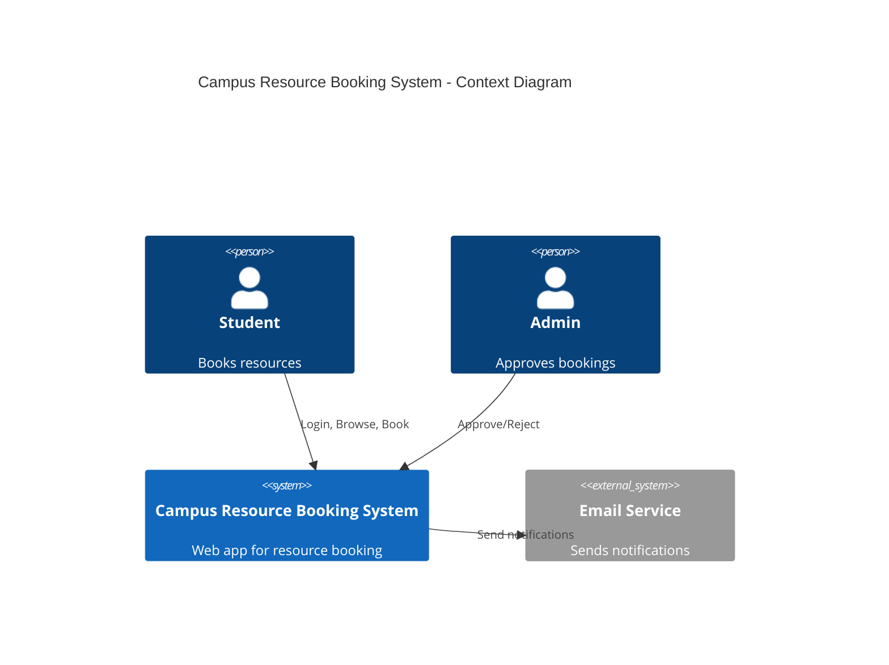
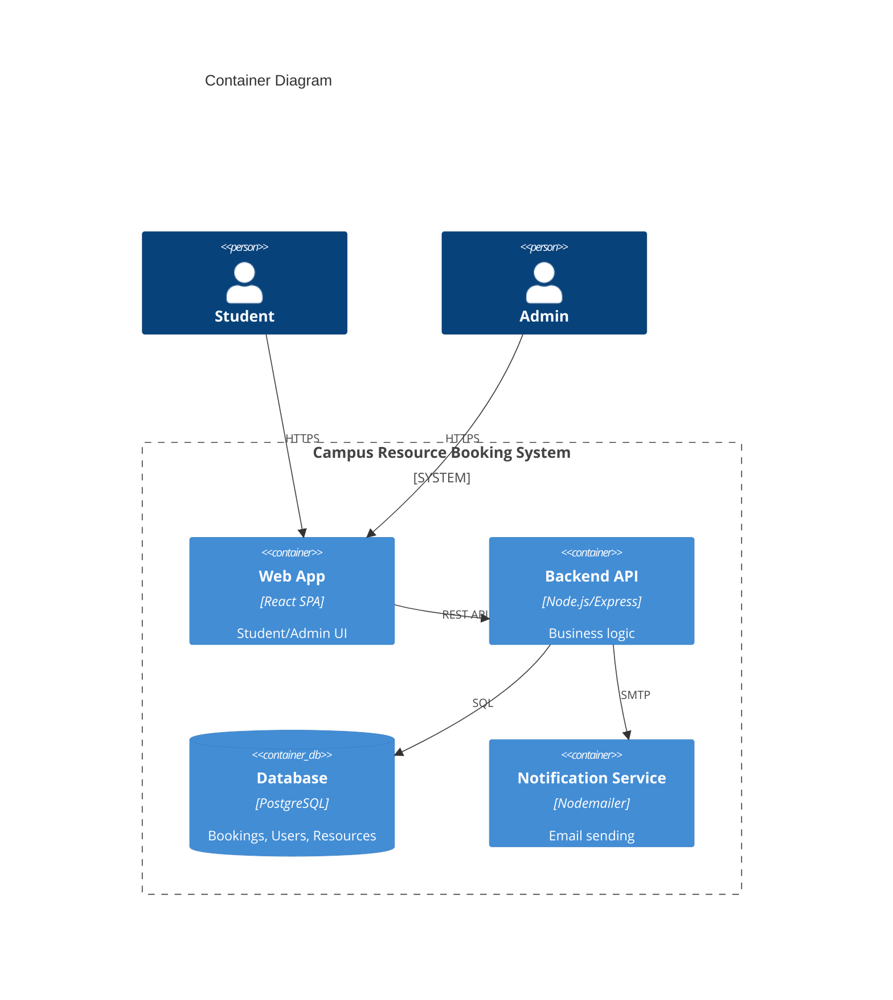
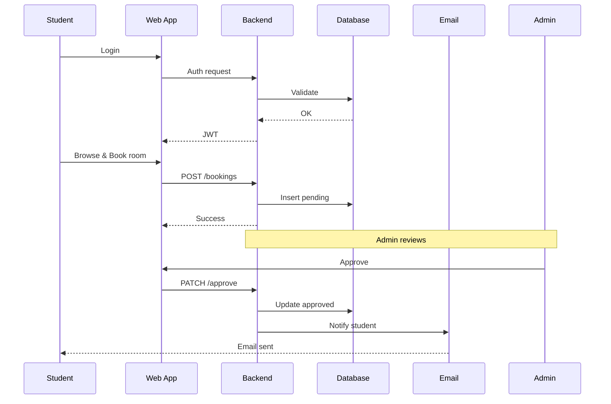

# C4 Architectural Diagrams

**Project Title:** Campus Resource Booking System  
**Author:** PAULOSE MAJA  
**Date:** March 10, 2026  

## 1. Introduction
*(Same as SPECIFICATION.md)* Domain: University/Education. Problem: Inefficient resource booking. Scope: Feasible individual project.

## 2. C4 Model Diagrams (Mermaid)

### Level 1: System Context


### Level 2: Containers


### Level 3: Components
```mermaid
C4Component
    title Component Diagram (Backend Focus)
    
    Container(backend, "Backend API") {
        Component(loginSvc, "Auth Service", "JWT", "Login/Logout")
        Component(resourceSvc, "Resource Service", "REST", "Browse/Availability")
        Component(bookingSvc, "Booking Service", "REST", "Create/View")
        Component(approvalSvc, "Approval Service", "REST", "Approve/Reject")
        Component(notificationComp, "Notification Component", "Internal", "Trigger emails")
    }
    
    Rel(loginSvc, db, "Verify users")
    Rel(resourceSvc, db, "Query resources")
    Rel(bookingSvc, db, "Create bookings")
    Rel(approvalSvc, db, "Update status")
    Rel(notificationComp, emailService, "Send")
```

### Level 4: End-to-End Booking Flow (Sequence)


## 3. Deployment
Docker containers for Backend/DB, hosted on Vercel/Heroku (future).

**All end-to-end components covered: UI → API → DB → Notifications.**

