# Class Diagram - Campus Resource Booking System

**Assignment 9 - Class Diagram Development**  
**Author:** PAULOSE MAJA  
**Date:** April 27, 2026

## 1. Overview

This document presents the comprehensive UML Class Diagram for the Campus Resource Booking System using Mermaid.js syntax. The diagram models the static structure of the system, including classes, attributes, methods, relationships (associations, aggregations, compositions), and multiplicity constraints.

---

## 2. Complete Class Diagram

```mermaid
classDiagram
    %% Enums and Value Objects (simplified representation)
    class UserRole {
        <<enumeration>>
        STUDENT
        FACULTY
        ADMIN
        MAINTENANCE
        AUDITOR
    }

    class UserStatus {
        <<enumeration>>
        ACTIVE
        INACTIVE
        SUSPENDED
    }

    class ResourceType {
        <<enumeration>>
        ROOM
        PROJECTOR
        COMPUTER_LAB
        EQUIPMENT
    }

    class ResourceAvailability {
        <<enumeration>>
        AVAILABLE
        BOOKED
        MAINTENANCE
        RETIRED
    }

    class BookingStatus {
        <<enumeration>>
        PENDING
        APPROVED
        REJECTED
        ACTIVE
        COMPLETED
        CANCELLED
        NO_SHOW
    }

    class ApprovalDecision {
        <<enumeration>>
        APPROVED
        REJECTED
        CONDITIONAL
    }

    class NotificationType {
        <<enumeration>>
        CONFIRMATION
        APPROVAL
        REJECTION
        REMINDER
        CANCELLATION
        NO_SHOW_WARNING
    }

    class NotificationChannel {
        <<enumeration>>
        EMAIL
        SMS
        IN_APP
    }

    class NotificationStatus {
        <<enumeration>>
        DRAFT
        SENT
        DELIVERED
        FAILED
        BOUNCED
    }

    class MaintenanceStatus {
        <<enumeration>>
        SCHEDULED
        IN_PROGRESS
        COMPLETED
        CANCELLED
    }

    class MaintenanceSeverity {
        <<enumeration>>
        LOW
        MEDIUM
        HIGH
    }

    %% Core Domain Classes

    class User {
        -userId: String (UUID)
        -email: String
        -password: String (hashed)
        -firstName: String
        -lastName: String
        -role: UserRole
        -department: String
        -phone: String
        -status: UserStatus
        -createdAt: DateTime
        -updatedAt: DateTime
        +register(email, password, firstName, lastName, role): User*
        +login(email, password): JWT
        +updateProfile(firstName, lastName, department, phone): void
        +changePassword(oldPassword, newPassword): void
        +logout(): void
        +suspendAccount(): void
        +getBookingHistory(): Booking[]
        +getRole(): UserRole
        +isActive(): boolean
        +validateEmail(email): boolean
    }

    class Resource {
        -resourceId: String (UUID)
        -name: String
        -description: String
        -type: ResourceType
        -location: String
        -capacity: Integer
        -availability: ResourceAvailability
        -maintenanceSchedule: DateTime[]
        -createdAt: DateTime
        -updatedAt: DateTime
        +addResource(name, type, location, capacity): Resource*
        +editResource(name, description, capacity): void
        +deleteResource(): void
        +checkAvailability(date, time, duration): boolean
        +markMaintenance(startDate, endDate): void
        +getBookingHistory(): Booking[]
        +getUtilizationRate(): float
        +updateAvailability(status): void
        +getBookingsInTimeRange(startDate, endDate): Booking[]
    }

    class Booking {
        -bookingId: String (UUID)
        -userId: String (FK)
        -resourceId: String (FK)
        -startDate: DateTime
        -endDate: DateTime
        -status: BookingStatus
        -purpose: String
        -notes: String
        -createdAt: DateTime
        -updatedAt: DateTime
        +submitBooking(resourceId, startDate, endDate, purpose): Booking*
        +cancelBooking(): void
        +getStatus(): BookingStatus
        +updateStatus(newStatus): void
        +sendConfirmation(): void
        +calculateDuration(): Integer
        +checkConflict(): boolean
        +markAsNoShow(): void
        +getApproval(): Approval*
        +isApproved(): boolean
        +isPending(): boolean
    }

    class Approval {
        -approvalId: String (UUID)
        -bookingId: String (FK)
        -adminId: String (FK)
        -decision: ApprovalDecision
        -reason: String
        -conditions: String
        -approvedAt: DateTime
        +approveBooking(bookingId, conditions): void
        +rejectBooking(bookingId, reason): void
        +getDecision(): ApprovalDecision
        +updateDecision(newDecision, reason): void
        +notifyUser(): void
        +hasConditions(): boolean
        +getConditionsText(): String
    }

    class Notification {
        -notificationId: String (UUID)
        -userId: String (FK)
        -type: NotificationType
        -subject: String
        -message: String
        -channel: NotificationChannel
        -status: NotificationStatus
        -sentAt: DateTime
        -deliveredAt: DateTime
        -relatedBookingId: String (FK)
        -createdAt: DateTime
        +createNotification(userId, type, message, channel): Notification*
        +sendNotification(): void
        +retryFailedNotification(): void
        +markAsDelivered(): void
        +getNotificationHistory(userId): Notification[]
        +cancelNotification(): void
        +isDelivered(): boolean
        +isFailed(): boolean
    }

    class Maintenance {
        -maintenanceId: String (UUID)
        -resourceId: String (FK)
        -scheduledBy: String (FK)
        -startDate: DateTime
        -endDate: DateTime
        -reason: String
        -severity: MaintenanceSeverity
        -status: MaintenanceStatus
        -notes: String
        -createdAt: DateTime
        -completedAt: DateTime
        +scheduleMaintenance(resourceId, startDate, endDate, reason): Maintenance*
        +startMaintenance(): void
        +completeMaintenance(): void
        +cancelMaintenance(): void
        +getAffectedBookings(): Booking[]
        +notifyAffectedUsers(): void
        +rescheduleBookings(): void
        +isActive(): boolean
        +hasOverlappingBookings(): boolean
    }

    %% Service/Manager Classes (optional but good practice)

    class BookingService {
        -bookingRepository: Repository
        -resourceService: ResourceService
        -notificationService: NotificationService
        +createBooking(user, resource, startDate, endDate): Booking*
        +cancelBooking(bookingId): void
        +getBookingsByUser(userId): Booking[]
        +getBookingsByResource(resourceId): Booking[]
        +checkConflicts(resourceId, startDate, endDate): boolean
        +approveBooking(bookingId, admin, conditions): void
        +rejectBooking(bookingId, admin, reason): void
    }

    class NotificationService {
        -notificationRepository: Repository
        -emailProvider: EmailProvider
        +sendBookingConfirmation(booking): void
        +sendApprovalNotification(booking, approval): void
        +sendRejectionNotification(booking, reason): void
        +sendReminderNotification(booking): void
        +retryFailedNotifications(): void
        +getDeliveryStatus(notificationId): NotificationStatus
    }

    class ResourceService {
        -resourceRepository: Repository
        -maintenanceService: MaintenanceService
        +getAvailableResources(date, time): Resource[]
        +getResourceById(resourceId): Resource
        +checkResourceAvailability(resourceId, startDate, endDate): boolean
        +updateResourceAvailability(resourceId, status): void
        +getResourceUtilization(resourceId, period): Statistics
    }

    class ApprovalService {
        -approvalRepository: Repository
        -userService: UserService
        -notificationService: NotificationService
        +submitForApproval(booking): void
        +approveBooking(bookingId, admin, conditions): void
        +rejectBooking(bookingId, admin, reason): void
        +getPendingApprovals(): Approval[]
        +getApprovalsByAdmin(adminId): Approval[]
    }

    class MaintenanceService {
        -maintenanceRepository: Repository
        -bookingService: BookingService
        -notificationService: NotificationService
        +scheduleMaintenance(resource, startDate, endDate): Maintenance*
        +startMaintenance(maintenanceId): void
        +completeMaintenance(maintenanceId): void
        +getUpcomingMaintenance(): Maintenance[]
        +handleAffectedBookings(maintenanceId): void
    }

    class AuthenticationService {
        -userRepository: Repository
        -jwtProvider: JWTProvider
        +registerUser(email, password, firstName, lastName): User*
        +loginUser(email, password): JWT
        +validateToken(token): boolean
        +logoutUser(userId): void
        +changePassword(userId, oldPassword, newPassword): void
    }

    %% Relationships

    %% User relationships
    User "1" -- "0..*" Booking : creates
    User "1" -- "0..*" Notification : receives
    User "1" -- "0..*" Approval : reviews (admin)
    User "1" -- "0..*" Maintenance : schedules

    %% Resource relationships
    Resource "1" -- "0..*" Booking : available_for
    Resource "1" -- "0..*" Maintenance : has

    %% Booking relationships
    Booking "1" -- "0..1" Approval : may_have
    Booking "1" -- "0..*" Notification : triggers

    %% Approval relationships
    Approval "1" -- "1" Booking : reviews

    %% Service relationships
    BookingService -- Resource : uses
    BookingService -- Notification : uses
    NotificationService -- Notification : manages
    ResourceService -- Resource : manages
    ApprovalService -- Approval : manages
    MaintenanceService -- Maintenance : manages
    MaintenanceService -- Booking : affects
    AuthenticationService -- User : manages
```



---

## 3. Detailed Class Specifications

### 3.1 Core Domain Classes

#### User Class
- **Visibility:** Public
- **Purpose:** Represents all system actors with role-based access
- **Key Attributes:**
  - `userId`: Unique identifier (UUID)
  - `email`: Unique email address for authentication
  - `password`: Hashed password using bcrypt
  - `role`: UserRole enum (STUDENT, FACULTY, ADMIN, MAINTENANCE, AUDITOR)
  - `status`: UserStatus enum (ACTIVE, INACTIVE, SUSPENDED)
- **Key Methods:**
  - `login()`: Authenticates user and returns JWT token
  - `register()`: Creates new user account with validation
  - `updateProfile()`: Allows profile editing
  - `getBookingHistory()`: Retrieves user's bookings
- **Constraints:** Email must be unique and verified before booking

#### Resource Class
- **Visibility:** Public
- **Purpose:** Models physical assets available for booking
- **Key Attributes:**
  - `resourceId`: Unique identifier (UUID)
  - `type`: ResourceType enum (ROOM, PROJECTOR, COMPUTER_LAB, EQUIPMENT)
  - `availability`: ResourceAvailability enum (AVAILABLE, BOOKED, MAINTENANCE, RETIRED)
  - `capacity`: Integer representing max concurrent users/items
  - `location`: Building/floor/room identification
- **Key Methods:**
  - `checkAvailability()`: Verifies time slot is free
  - `markMaintenance()`: Schedules downtime
  - `getUtilizationRate()`: Calculates usage percentage
- **Constraints:** Capacity bounds vary by type; cannot have overlapping maintenances

#### Booking Class
- **Visibility:** Public
- **Purpose:** Represents a resource reservation request
- **Key Attributes:**
  - `bookingId`: Unique identifier (UUID)
  - `userId`, `resourceId`: Foreign keys linking to User and Resource
  - `startDate`, `endDate`: Reservation time window
  - `status`: BookingStatus enum (7 states from PENDING to NO_SHOW)
  - `purpose`: Description of intended use
- **Key Methods:**
  - `submitBooking()`: Creates booking with conflict detection
  - `cancelBooking()`: User cancels pending/approved bookings
  - `checkConflict()`: Verifies no overlapping bookings
  - `markAsNoShow()`: Flags if user didn't check in
- **Constraints:**
  - Duration: 15 min to 8 hours
  - No double-booking (unique constraint on resourceId + date/time)
  - Students max 5 concurrent bookings

#### Approval Class
- **Visibility:** Public
- **Purpose:** Admin decision on booking requests
- **Key Attributes:**
  - `approvalId`: Unique identifier (UUID)
  - `bookingId`: Links to specific Booking (1:1 relationship)
  - `adminId`: References admin User
  - `decision`: ApprovalDecision enum (APPROVED, REJECTED, CONDITIONAL)
  - `reason`: Required if rejected; optional if approved
  - `conditions`: Optional criteria for conditional approvals
- **Key Methods:**
  - `approveBooking()`: Admin approves with optional conditions
  - `rejectBooking()`: Admin rejects with mandatory reason
  - `updateDecision()`: Allows decision reversal if booking not active
  - `notifyUser()`: Triggers notification to user
- **Constraints:** All pending bookings reviewed within 24 hours (SLA)

#### Notification Class
- **Visibility:** Public
- **Purpose:** Tracks system communications to users
- **Key Attributes:**
  - `notificationId`: Unique identifier (UUID)
  - `userId`: References recipient User
  - `type`: NotificationType enum (CONFIRMATION, APPROVAL, REJECTION, REMINDER, CANCELLATION, NO_SHOW_WARNING)
  - `channel`: NotificationChannel enum (EMAIL, SMS, IN_APP)
  - `status`: NotificationStatus enum (DRAFT, SENT, DELIVERED, FAILED, BOUNCED)
  - `relatedBookingId`: Optional link to triggering Booking
- **Key Methods:**
  - `sendNotification()`: Dispatches via appropriate channel
  - `retryFailedNotification()`: Retries up to 3 times within 1 hour
  - `markAsDelivered()`: Updates status upon confirmation
  - `getNotificationHistory()`: Retrieves user's past notifications
- **Constraints:** 95% email delivery rate SLA; failed notifications retry automatically

#### Maintenance Class
- **Visibility:** Public
- **Purpose:** Manages scheduled resource downtime
- **Key Attributes:**
  - `maintenanceId`: Unique identifier (UUID)
  - `resourceId`: References Resource being maintained
  - `scheduledBy`: References User (admin/maintenance staff)
  - `startDate`, `endDate`: Maintenance window
  - `severity`: MaintenanceSeverity enum (LOW, MEDIUM, HIGH)
  - `status`: MaintenanceStatus enum (SCHEDULED, IN_PROGRESS, COMPLETED, CANCELLED)
  - `reason`: Description of maintenance work
- **Key Methods:**
  - `scheduleMaintenance()`: Creates maintenance window
  - `startMaintenance()`: Begins downtime, updates resource availability
  - `completeMaintenance()`: Ends downtime, restores availability
  - `getAffectedBookings()`: Lists overlapping bookings
  - `notifyAffectedUsers()`: Alerts users 24 hours before cancellation
  - `rescheduleBookings()`: Suggests alternative times
- **Constraints:**
  - Cannot overlap existing bookings without cancellation
  - HIGH severity can force-cancel with 48-hour notice
  - Logs retained 2 years for audit

---

### 3.2 Service Classes

#### BookingService
- **Purpose:** Orchestrates booking creation, cancellation, and status management
- **Key Responsibility:** Enforces business rules (conflict detection, duration validation)
- **Dependencies:** BookingRepository, ResourceService, NotificationService

#### NotificationService
- **Purpose:** Manages all communication channels (email, SMS, in-app)
- **Key Responsibility:** Ensures timely delivery with retries and SLA tracking
- **Dependencies:** NotificationRepository, EmailProvider

#### ResourceService
- **Purpose:** Manages resource inventory and availability
- **Key Responsibility:** Real-time availability checking and utilization analytics
- **Dependencies:** ResourceRepository, MaintenanceService

#### ApprovalService
- **Purpose:** Coordinates approval workflow between users and admins
- **Key Responsibility:** Approval decision logic and user notification
- **Dependencies:** ApprovalRepository, NotificationService

#### MaintenanceService
- **Purpose:** Orchestrates maintenance scheduling and affected booking management
- **Key Responsibility:** Prevents booking conflicts during maintenance
- **Dependencies:** MaintenanceRepository, BookingService, NotificationService

#### AuthenticationService
- **Purpose:** Manages user registration and login workflows
- **Key Responsibility:** JWT token generation and password security
- **Dependencies:** UserRepository, JWTProvider

---

## 4. Relationships & Multiplicities

| Relationship | From | To | Cardinality | Type | Notes |
|--------------|------|-----|-------------|------|-------|
| creates | User | Booking | 1 to 0..* | Aggregation | User submits many bookings |
| receives | User | Notification | 1 to 0..* | Aggregation | User receives many notifications |
| reviews | User (admin) | Approval | 1 to 0..* | Association | Admin makes many approvals |
| schedules | User | Maintenance | 1 to 0..* | Association | Admin/Staff schedules maintenance |
| available_for | Resource | Booking | 1 to 0..* | Aggregation | Resource has many bookings |
| has | Resource | Maintenance | 1 to 0..* | Aggregation | Resource undergoes maintenance |
| may_have | Booking | Approval | 1 to 0..1 | Association | Booking has optional approval |
| triggers | Booking | Notification | 1 to 0..* | Association | Booking triggers notifications |
| reviews | Approval | Booking | 1 to 1 | Association | Approval corresponds to booking |

---

## 5. Design Patterns & Principles Applied

### 5.1 Design Patterns

1. **Repository Pattern**
   - Abstracts data access (database operations)
   - Enables unit testing with mock repositories
   - Example: `BookingRepository.findById(bookingId)`

2. **Service Layer Pattern**
   - Encapsulates business logic separate from entities
   - Services coordinate between domain classes
   - Example: `BookingService.createBooking()` validates and orchestrates

3. **Factory Pattern**
   - Creation of notifications, approvals, maintenance records
   - Ensures consistent object initialization
   - Example: `NotificationFactory.createConfirmation(booking)`

4. **Observer Pattern**
   - Notifications triggered by status changes
   - Loose coupling between Booking and Notification
   - Example: BookingStatusChanged event triggers NotificationService

5. **Strategy Pattern**
   - Different notification channels (EMAIL, SMS, IN_APP)
   - Switchable implementations based on user preference
   - Example: `NotificationChannel.EMAIL` uses EmailProvider

### 5.2 SOLID Principles

- **Single Responsibility:** Each class has one reason to change (e.g., Booking handles booking logic; NotificationService handles communication)
- **Open/Closed:** Services extend functionality without modifying existing code
- **Liskov Substitution:** NotificationChannels are interchangeable
- **Interface Segregation:** Services expose only necessary methods
- **Dependency Inversion:** Services depend on abstractions (repositories), not concrete implementations

---

## 6. Constraints & Validations

### 6.1 Attribute Constraints

| Class | Attribute | Constraint | Rationale |
|-------|-----------|-----------|-----------|
| User | email | Unique, valid email format | One account per email |
| User | password | Min 8 chars, bcrypt hashed | Security requirement |
| Booking | duration | 15 min to 8 hours | Reasonable usage window |
| Booking | startDate | Must be future | Cannot book past times |
| Resource | capacity | Min 1, max varies by type | Business logic |
| Notification | type | Required enum | Defines message template |
| Maintenance | severity | LOW, MEDIUM, HIGH | Determines cancellation policy |

### 6.2 Business Rule Validations

```
Class Booking.submitBooking(resource, startDate, endDate, purpose)
  Pre-condition:
    - User.status == ACTIVE
    - Resource.availability == AVAILABLE
    - (endDate - startDate) >= 15 minutes AND <= 8 hours
    - startDate > NOW()
    - User has < 5 concurrent bookings
  
  Invariant:
    - No (resource, startDate, endDate) overlap exists
    
  Post-condition:
    - booking.status == PENDING
    - Notification (CONFIRMATION) sent to user
    - booking.id returned
```

---

## 7. Alignment with Previous Assignments

### 7.1 Requirements (Assignment 4) Mapping

| Requirement | Class | Method | Validation |
|-------------|-------|--------|-----------|
| FR1: Authentication | AuthenticationService | loginUser(), registerUser() | Email verification, account lockout |
| FR2: Browse Resources | ResourceService | getAvailableResources() | Real-time availability filter |
| FR3: Calendar View | Resource | getBookingHistory() | Color-coded availability |
| FR4: Booking Submission | BookingService | createBooking() | Conflict detection, status PENDING |
| FR5: Admin Dashboard | ApprovalService | getPendingApprovals() | Lists pending bookings by admin |
| FR6: Approval/Rejection | ApprovalService | approveBooking(), rejectBooking() | Updates booking.status, sends notification |
| FR7: Email Notifications | NotificationService | sendNotification() | 95% delivery SLA, auto-retry |
| FR8: Resource Management | ResourceService | addResource(), editResource(), deleteResource() | CRUD with validation |
| FR9: User Profile | User | updateProfile(), getBookingHistory() | Edit personal info and booking history |
| FR10: Reports Generation | ResourceService | getResourceUtilization() | Export usage statistics |
| FR11: Maintenance Scheduling | MaintenanceService | scheduleMaintenance() | Blocks bookings during downtime |
| FR12: Search & Audit Logs | (Implicit in repositories) | findBy(), getHistory() | Full history exportable |

### 7.2 Use Case (Assignment 5) Mapping

| Use Case | Primary Classes | Key Methods | Flow |
|----------|-----------------|-------------|------|
| Login | AuthenticationService, User | loginUser(), validateToken() | Email/Password → JWT token |
| Browse Resources | ResourceService, Resource | getAvailableResources(), checkAvailability() | Filter by type/location/time |
| Submit Booking | BookingService, Booking | createBooking(), checkConflict() | Validate → Create PENDING → Send confirmation |
| Approve/Reject | ApprovalService, Approval | approveBooking(), rejectBooking() | Update status → Send notification |
| Manage Resources | ResourceService, Resource | addResource(), editResource(), deleteResource() | CRUD operations with validation |
| View Profile | User | updateProfile(), getBookingHistory() | Display/edit user info & bookings |
| Generate Reports | ResourceService | getResourceUtilization() | Query & export statistics |
| Schedule Maintenance | MaintenanceService, Maintenance | scheduleMaintenance(), handleAffectedBookings() | Create maintenance → Notify users → Cancel bookings |

### 7.3 State Diagrams (Assignment 8) Mapping

| State Diagram Entity | Class | Status Enum | State Transitions | Validation |
|----------------------|-------|-------------|-------------------|-----------|
| Resource | Resource | availability | AVAILABLE → BOOKED → InUse → MAINTENANCE | checkAvailability() |
| Booking | Booking | status | PENDING → APPROVED → ACTIVE → COMPLETED | updateStatus() with guards |
| UserAccount | User | status | INACTIVE → ACTIVE → SUSPENDED | suspendAccount() |
| Notification | Notification | status | DRAFT → SENT → DELIVERED (with FAILED/BOUNCED) | retryFailedNotification() |
| Approval | Approval | decision | PendingReview → APPROVED/REJECTED/CONDITIONAL | updateDecision() |
| Maintenance | Maintenance | status | SCHEDULED → IN_PROGRESS → COMPLETED | startMaintenance() → completeMaintenance() |

---

## 8. Validation & Consistency

### 8.1 Data Integrity Rules

1. **Referential Integrity:**
   - Booking.userId must reference existing User
   - Booking.resourceId must reference existing Resource
   - Approval.bookingId must reference existing Booking

2. **Temporal Integrity:**
   - endDate ≥ startDate for all time-bound entities
   - createdAt ≤ updatedAt
   - No future maintenance overlaps

3. **Business Logic Integrity:**
   - Resource in MAINTENANCE state cannot accept new bookings
   - User cannot cancel ACTIVE bookings
   - REJECTED Approval must include reason

---

## 9. Key Design Decisions

### Decision 1: Approval as Separate Entity
**Rationale:** Approval is a distinct entity, not a property of Booking, because:
- Approvals can be reversed before booking activation
- Admin metadata (approver ID, timestamp) is valuable for audit
- Future enhancements (conditional approvals, escalations) require flexibility

**Alternative Considered:** Approval fields directly on Booking
**Why Rejected:** Would bloat Booking; complicates reversal logic

### Decision 2: Notification as Separate Entity
**Rationale:** Notifications are tracked separately to:
- Support retry logic for failed deliveries
- Track delivery status (important for SLA compliance)
- Enable multi-channel delivery (email, SMS, in-app)
- Audit trail of all communications

**Alternative Considered:** Implicit notifications triggered on status change
**Why Rejected:** No visibility into failures; cannot retry; no audit trail

### Decision 3: Service Layer Pattern
**Rationale:** Services encapsulate business logic to:
- Enforce business rules consistently
- Enable transaction management
- Simplify testing (mock services)
- Separate concerns from entities

**Alternative Considered:** Logic directly in entities (anemic domain model)
**Why Rejected:** Violates Single Responsibility; harder to test; business rules scattered

### Decision 4: Maintenance as Separate Entity
**Rationale:** Explicit Maintenance entity enables:
- Scheduled downtime tracking
- Affected booking detection and rescheduling
- Audit trail of maintenance history
- Future preventive maintenance scheduling

**Alternative Considered:** Maintenance periods as part of Resource.maintenanceSchedule
**Why Rejected:** Cannot track status (SCHEDULED, IN_PROGRESS, COMPLETED); no audit trail

### Decision 5: Status Enums Over Boolean Flags
**Rationale:** Using status enums (not boolean properties) ensures:
- Clear state machine semantics
- Extensibility without schema changes
- Validation at database level
- Self-documenting code

**Alternative Considered:** is_active, is_approved boolean flags
**Why Rejected:** Cannot represent intermediate states; conflicts hard to detect

---

## 10. Scalability & Future Considerations

### 10.1 Anticipated Extensions

1. **Payment Integration:** Add `Payment` class for paid resource bookings
2. **Waitlist:** Add `Waitlist` entity for automatic rebooking when slots free
3. **Groups/Teams:** Extend `Booking` to support multi-user reservations
4. **Resource Categories:** Add `ResourceCategory` for hierarchical resource organization
5. **Recurring Bookings:** Add `RecurringBooking` pattern for repeat reservations
6. **Analytics:** Add `UsageStatistics` and `AuditLog` entities for reporting

### 10.2 Database Considerations

- Index on (resourceId, startDate, endDate) for booking conflict detection
- Index on (userId, createdAt) for user history queries
- Index on Booking.status for dashboard queries
- Partition Notification and AuditLog tables by date for performance
- Archive old maintenance records after 2-year retention

### 10.3 API Considerations

- Paginate list endpoints (bookings, resources, approvals)
- Implement soft deletes for resources (never hard-delete if bookings exist)
- Use transaction isolation levels to prevent race conditions
- Cache resource availability (with TTL) for performance

---

## 11. Conclusion

The class diagram comprehensively models the Campus Resource Booking System's static structure, incorporating:
- **6 core domain classes:** User, Resource, Booking, Approval, Notification, Maintenance
- **6 service classes:** BookingService, NotificationService, ResourceService, ApprovalService, MaintenanceService, AuthenticationService
- **8 enumeration types:** Capturing valid values for key properties
- **Design patterns:** Repository, Service Layer, Factory, Observer, Strategy
- **Business rule validations:** Enforced at class and database levels
- **Complete traceability:** To requirements, use cases, and state diagrams

This design ensures maintainability, testability, extensibility, and alignment with domain requirements while adhering to SOLID principles and established software engineering best practices.
