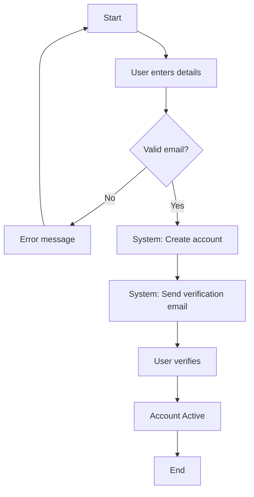
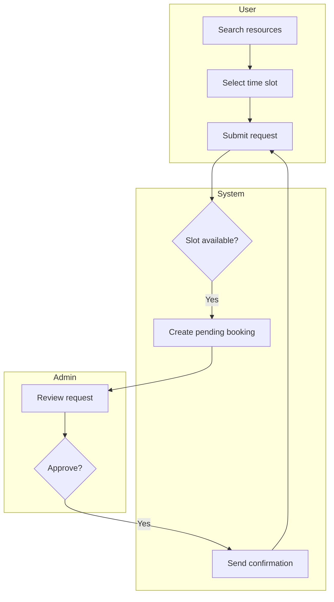
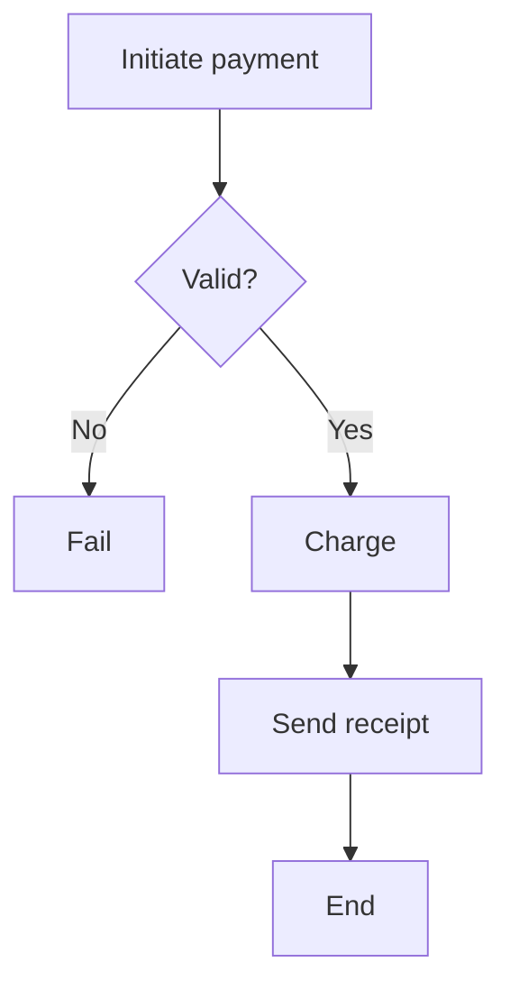
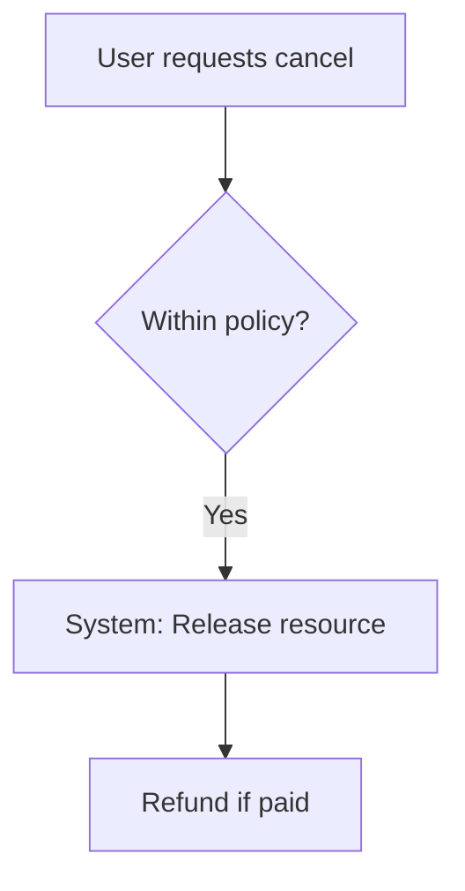
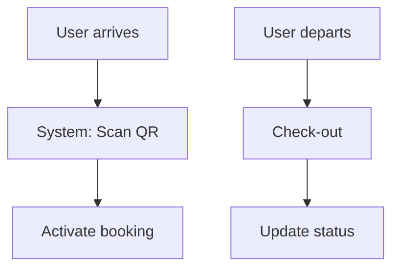
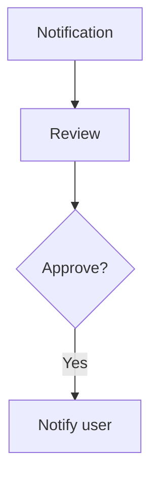
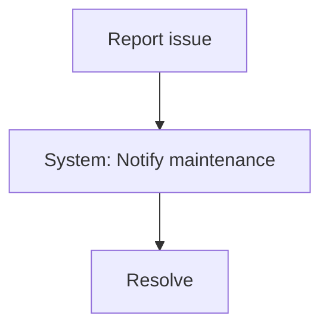
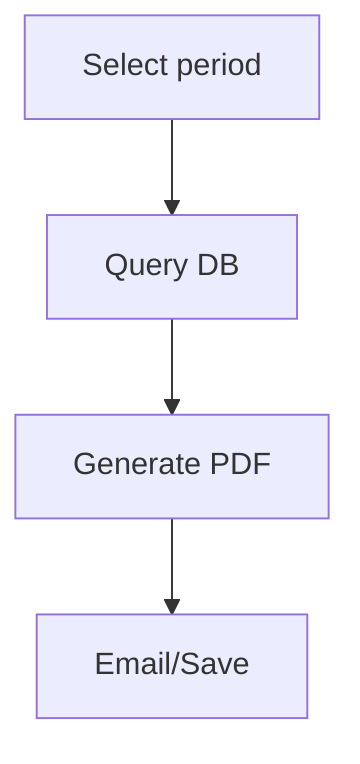

# Activity Workflow Modeling - Activity Diagrams

8 key workflows with swimlanes (User/System/Admin).

## 1. User Registration

**Explanation**: FR-001, addresses student registration needs.

## 2. Resource Booking

**Explanation**: Core booking, parallel search/notify possible; meets scalability.

## 3. Payment Processing

**Explanation**: For deposits.

## 4. Booking Cancellation

**Explanation**: FR-007.

## 5. Check-in/Check-out

**Explanation**: Usage tracking.

## 6. Admin Approval

**Explanation**: Bottleneck control.

## 7. Issue Reporting

**Explanation**: Maintenance.

## 8. Generate Report

**Explanation**: Admin analytics.
