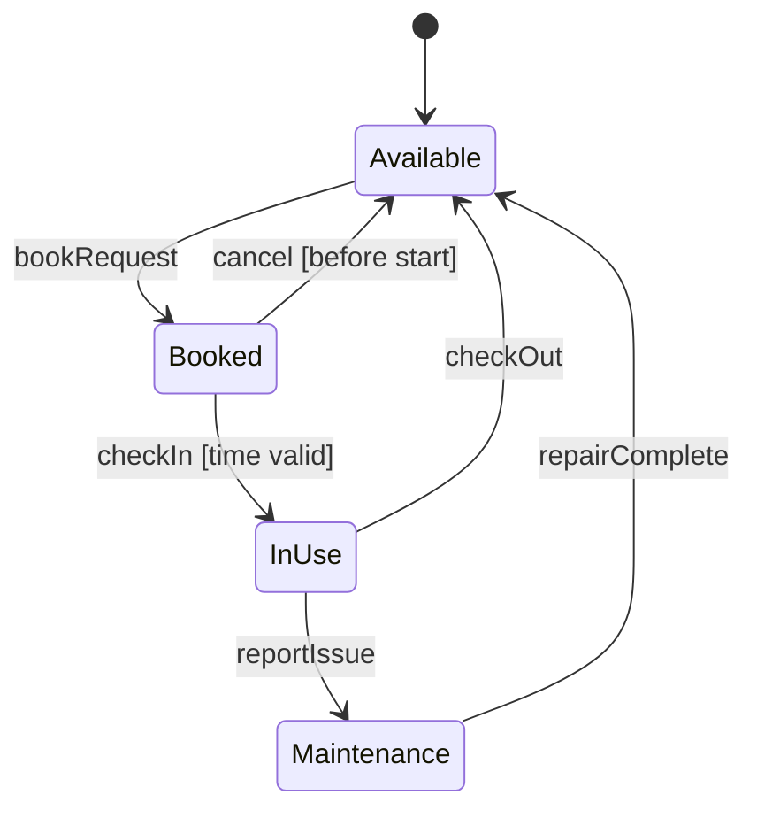
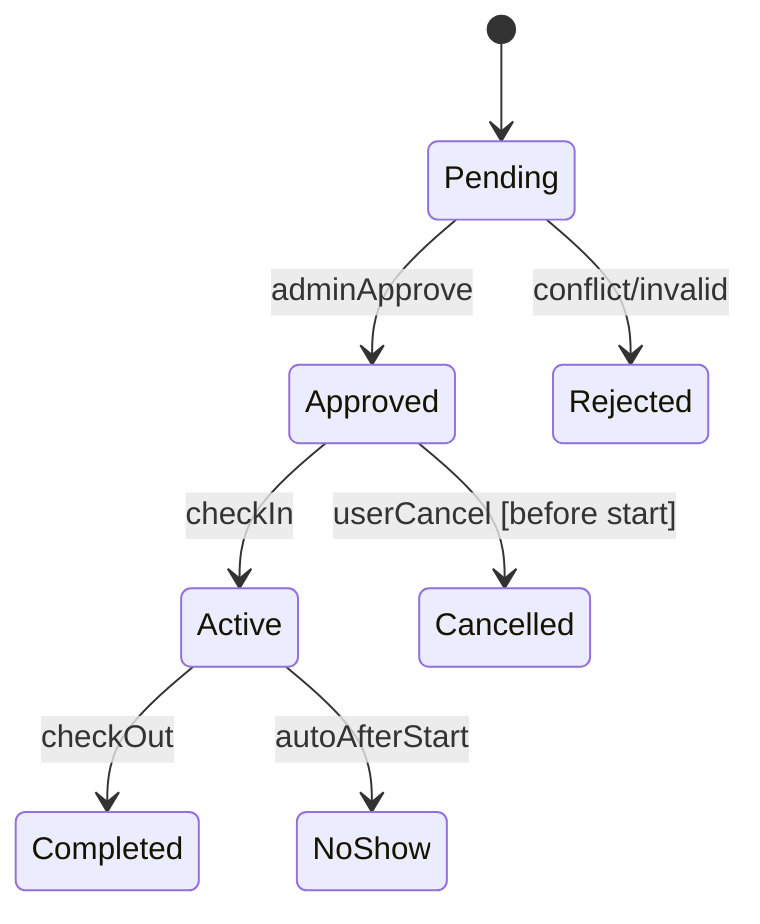
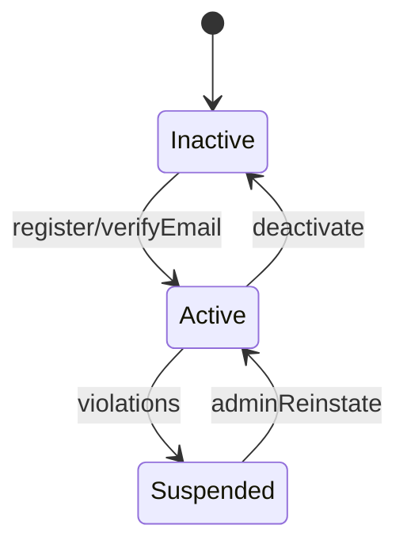
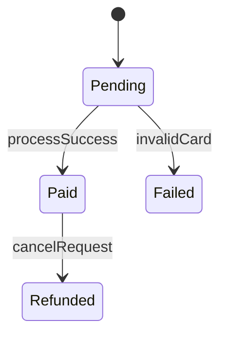
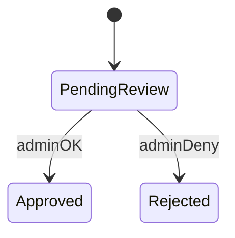
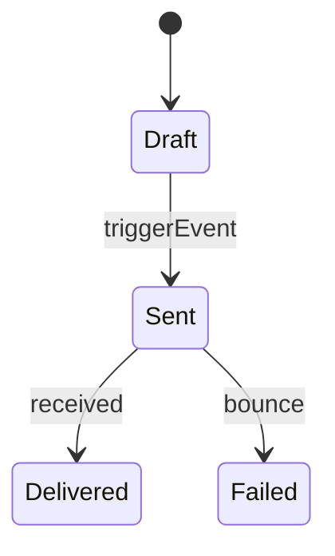
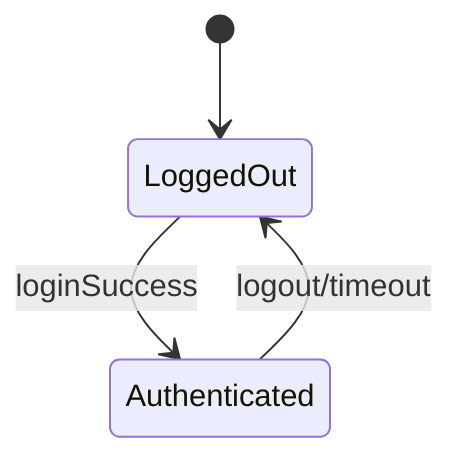
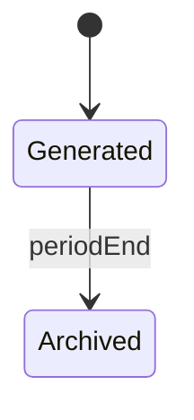

# Object State Modeling - State Transition Diagrams

Diagrams for 8 critical objects in Campus Resource Booking System, mapped to functional requirements (inferred FR from Assignment 4: FR-001 User Reg, FR-002 Search/Book, etc.).

## 1. Resource (e.g., Room/Equipment)

**Explanation**: Tracks resource lifecycle. Maps to FR-002 (booking), FR-007 (cancellation). Guard ensures no overlap bookings.

## 2. Booking

**Explanation**: Booking flow with admin approval. Aligns with Assignment 6 user story "Submit booking request".

## 3. UserAccount

**Explanation**: User lifecycle, FR-001 registration.

## 4. Payment

**Explanation**: For paid resources, FR-004 payment.

## 5. Approval

**Explanation**: Admin approval process.

## 6. Notification

**Explanation**: Email/SMS for confirmations.

## 7. Session (User Login)

**Explanation**: Security, FR-003 auth.

## 8. Report

**Explanation**: Usage reports for admin.
